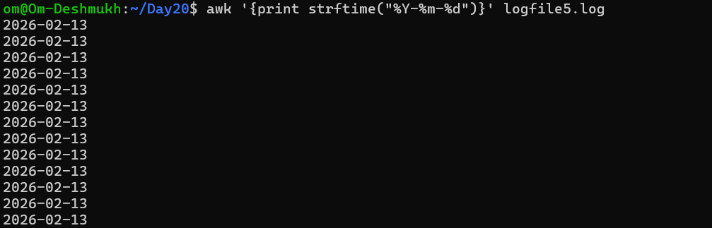
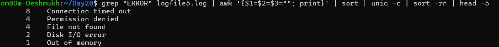

# Day 20 – Bash Scripting Challenge: Log Analyzer and Report Generator


### Task 1: Input and Validation
Your script should:
1. Accept the path to a log file as a command-line argument
2. Exit with a clear error message if no argument is provided
3. Exit with a clear error message if the file doesn't exist


``` bash
#!/bin/bash

# Step 1: Check argument diya ya nahi
if [ $# -eq 0 ]; then
    echo "Error: Please provide log file path"
    echo "Usage: ./script.sh <log_file_path>"
    exit 1
fi

# Step 2: Argument ko variable me store
logfile=$1

# Step 3: File exist karti hai ya nahi
if [ ! -f "$logfile" ]; then
    echo "Error: File does not exist -> $logfile"
    exit 1
fi

echo "File found: $logfile"

```

### Task 2: Error Count
1. Count the total number of lines containing the keyword `ERROR` or 
2. Print the total error count to the console

**awk '/ERROR/ {count++} END {print count}' logfile1.log**


### Task 3: Critical Events
1. Search for lines containing the keyword `CRITICAL`
2. Print those lines along with their line number

**awk '/CRITICAL/ {print "Line " NR ": " $0}' logfile2.log**


### Task 4: Top Error Messages
1. Extract all lines containing `ERROR`
2. Identify the **top 5 most common** error messages
3. Display them with their occurrence count, sorted in descending order


**grep "ERROR" logfile4.log | awk '{$1=$2=$3=""; print}' | sort | uniq -c | sort -rn | head -5**


### Task 5: Summary Report
Generate a summary report to a text file named `log_report_<date>.txt` (e.g., `log_report_2026-02-11.txt`). The report should include:
1. Date of analysis


2. Log file name


3. Total lines processed


4. Total error count


5. Top 5 error messages with their occurrence count


6. List of critical events with line numbers


### Task 6 (Optional): Archive Processed Logs
Add a feature to:
1. Create an `archive/` directory if it doesn't exist
2. Move the processed log file into `archive/` after analysis
3. Print a confirmation message


### What you learned (3 key points)

1. Learned to check log files using basic Linux commands.

2. Learned to find errors, critical events and top problems in logs.

3. Learned to move old logs into an archive folder after checking.